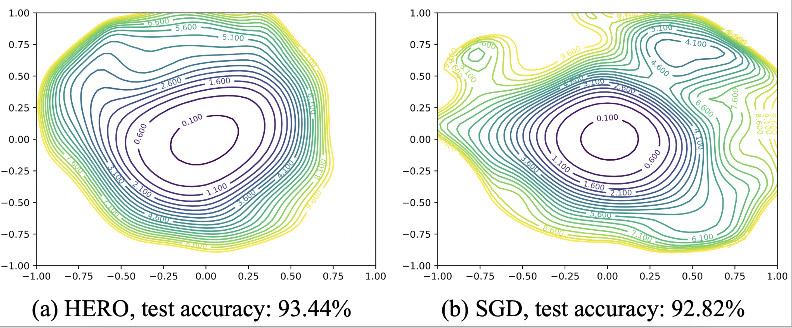

# HERO

This is the code implementation of "HERO: Hessian-Enhanced Robust Optimization for Unifying and Improving Generalization and Quantization Performance".
This work aims to minimize the Hessian eigenvalues of the weights through a gradient-based training process.

## Train Command Example

python cifar_hero.py -a resnet --depth 20  --epochs 200  --gamma 0.1  --lr 0.1 --checkpoint checkpoints/cifar10/resnet-20/ --step_size 0.5 --lambda_hero 5.0 --manualSeed 0

## Result Comparison

    

  <em>Loss surface contour along 2 random directions around converged weights. Estimated on ResNet20 model on CIFAR-10 dataset trained with HERO and SGD</em>

## More Results and Discussion

You can refer to our DAC'22 paper [HERO](https://arxiv.org/pdf/2111.11986.pdf).
If you have any question, you can email the authors [Huanrui](mailto:huanrui@berkeley.edu) and [Xiaoxuan](mailto:xy92@duke.edu).

## Acknowledgement

The training and evaluation codes and the model architectures are adapted from [bearpaw/pytorch-classification](https://github.com/bearpaw/pytorch-classification).

The sam function is adapted from [davda54/sam](https://github.com/davda54/sam).

